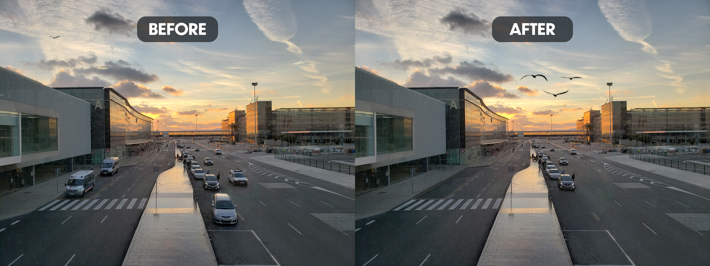

I took this at the airport in Barcelona shortly after landing. I decided to remove some of the vehicles to make it feel less busy. One of the more subtle changes include cleaning up the window on the left-side building. My favorite part of this was the seagulls. I cut out the original seagull from the top-left, duplicated it a couple of times, and adjusted the wings to give the appearance of three different birds flying together. 