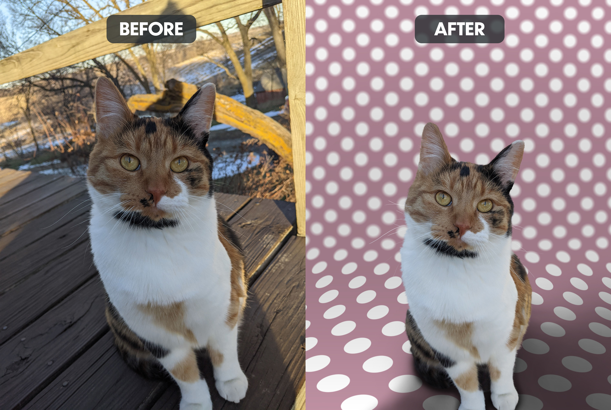

Meet Juniper. When she first showed up at our place, she was not fond of people, but loved being around her sister. After showing her that people can be friendly, she's one of the more loveable cats we've had. With this example of background removal, I went a step further and added a custom polka dot background, but this background could have really been anything.

Here're the edits that were made to this:

1. I removed the cat from the background. There was quite a bit of fringing (color from the original background bleeding through the edges of our subject) that took quite a bit of meticulous work to get just right. On furry subjects like Juniper, I use a hair-like brush on the edges after cutting them out and then color in fringed edges to match the rest of the subject. 
2. Since the whiskers and some longer fur in the ears was lost when cutting her out from the background, I redrew the whiskers and filled in the appropriate colors to match the original ones. 
3. I created a custom background for our subject to sit on.
4. I blurred out the background with a tilt shift to bring focus to our subject.
5. I then created a shadow for her from scratch, since the original image didn't offer a good one. 