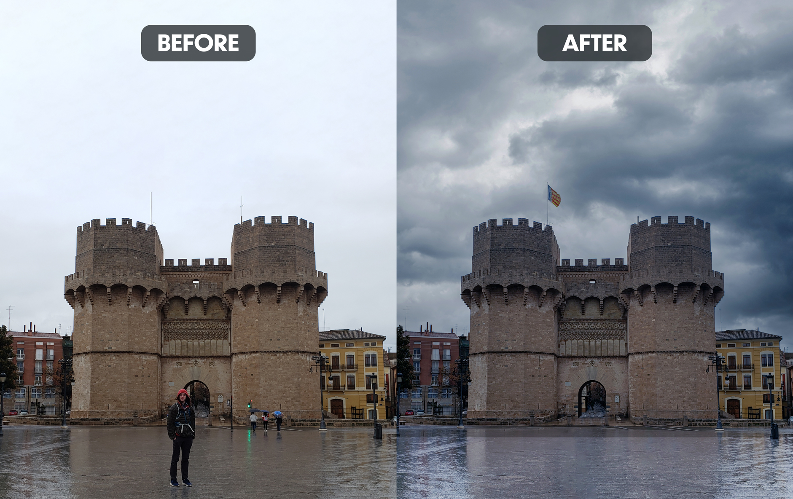

I had this picture taken when I was visiting Valencia in eastern Spain. The city is full of incredible architecture. This is one of the remaining castle gates in the city. You can even venture to the top for a small price. 

Here are a list of edits I made on this one:

1. Most obviously, I removed myself, mostly to show that this sort of edit is possible. It's worth noting that I did have another image showing the tunnel without me there, so I used that for the area of the tunnel that I was covering with my body. This could have been done with just the one image, but this gave a better, more accurate result.
2. I removed the people from the image on the right, as well as the stoplight and the post next to them. I rebuilt the areas that would have been there in their absence.
3. I replaced the dull, overcast sky with a stormy looking one. It was already raining, so this wasn't a stretch and the wet, reflective ground helps to sell the new sky. 
4. I added a flag to the flagpole. I believe I had another image of the castle with the flag showing, so this was fairly simple. However, it's worth noting that the flag could have been taken from a completely different image and added here, as long as the perspective matched fairly closely to this image.
5. I made some color corrections and color grade choices to match the gloomier looking sky.
