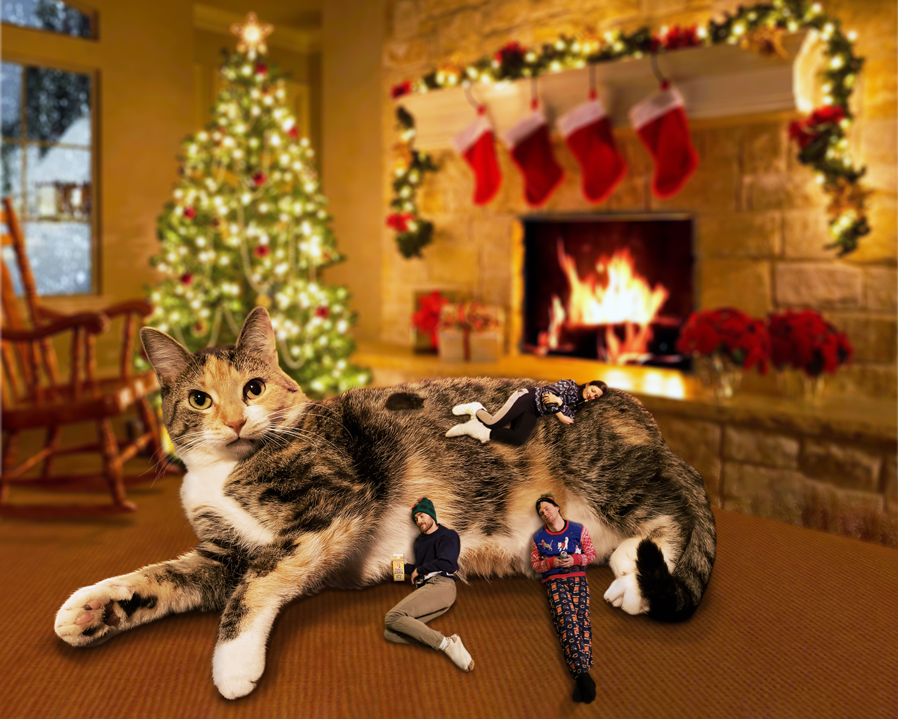

I created this composite of our cat, Rosie, for our Christmas card one year. I specifically shot each picture with the scene planned out ahead of time to get the desired poses and angles. Once I got them into Photoshop, this is more or less the process that I took to get this end result:

1. I removed each subject from their background, resized and positioned them approximately where they would end up.
2. I had to clean up the edges of each subject so their previous backgrounds fringe didn't show. Rosie, the giant cat, was the most time consuming as this required using fur-like brushes to create a convincing composite.
3. I added the shadows of each subject and blended them a bit. Some shadows were based on the original shadows and others were totally custom to get the desired look.
4. The rimlights were added to subjects where necessary to act as the glow being cast by the fireplace.
5. I added a blur to the background to bring the subjects into the foreground and in focus.
6. I used a color grade on the entire composite to tie everything together. I went too hard on the red starting out, but later toned that back a bit. 