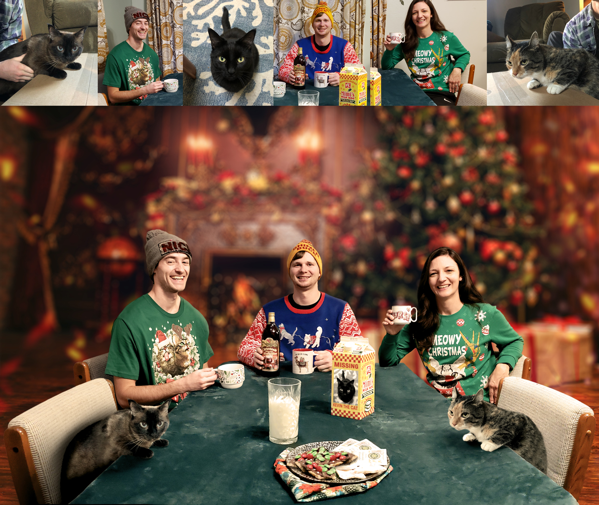

This was another composite created for a Christmas card one year. As you can see in the upper-most images, I had enough pictures of each subject that I could select the best versions of each to add to the composite. Here was my process, more or less:

1. I added the cats to the table and gave them shadows, following suit with the other directional shadows. The chairs were moved during our shoot of the table setup and we didn't have a camera tripod. This created a lot more work than would have otherwise been necessary, but it turend out pretty great in the end. 
2. I added the black cat to the milk carton, which was more of an inside joke. I also changed the text to "Missing; Kevin the Cat"
3. I used the best versions of each of the human subjects and cut them out tediously. Edges had to be fixed on all of them.
4. I added in a Christmas-themed background and gave it tilt shift blur to give the illusion of depth in the scene. It's hardly noticable, but you can see that the floor (also part of the composited background) is in focus along with the rest of the foreground. I think this detail helps a lot in selling the composite.