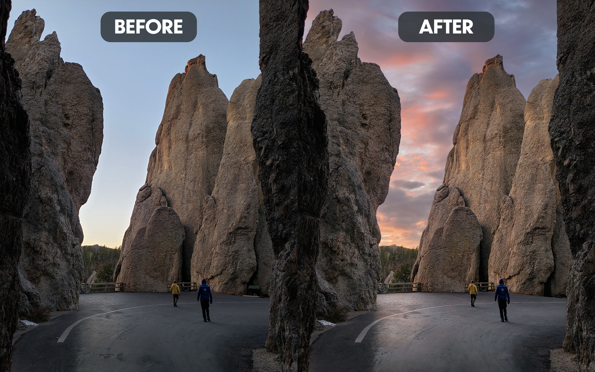

The sky in this image did not match the beauty of the rock features, so I added a sunset sky with more colorful cloud cover. This was taken close to dusk, so the clouds match pretty well with what could have been on a cloudier day. Because the ground is fairly reflective, I added a subtle reflection of the new sky onto the ground. There were some imperfections on the road nearest the camera, so I patched those to remove the distraction. Lastly, I removed the eyesore of a trash and recycling receptacle on the far right side of the image, patching in the rock feature as it might have shown.