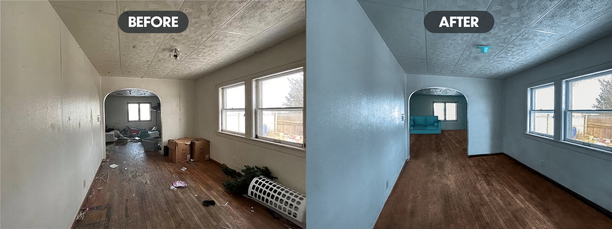

I used this image, because it was so ridiculously hopeless to begin with. I wanted to show that large changes can be made in situations like these. 

Here are a list of edits that I made: 

1. I cleaned up the floor removed smudges and imperfections from both the floor and walls.
2. I made some color corrections to the windows, so we could make out the exterior a bit better.
3. I made some paint color adjustments to the walls.
4. I added 3D models of a couch and light fixture. These are far from perfect, but are more-so meant to aid in the visualization of refurnishing this area.
5. I made some minor color changes to the composite as a whole to tie everything together.