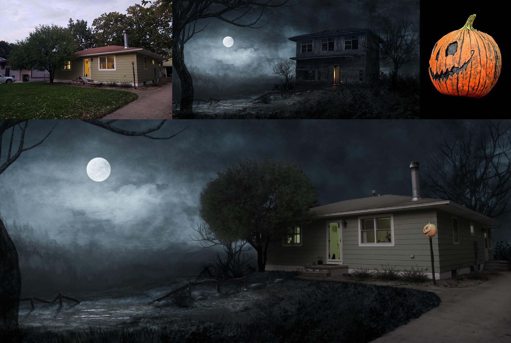

Spooky Season is always a fun time. Lasting just a week or two, the vibes, events, and movies make for a different experience than any other part of the year has to offer. 

This composite was created using an existing scene of a haunted house, an average neighborhood house, and a jack-o-lantern. Here are the steps I took in creating this.
1. I cut the house out of it's surrounding area, including the driveway, and placed it approximately where I wanted it to end up. 
2. I made some color adjustments so the house would match the spooky scene. 
3. The original haunted house was much larger than our substitute, so I had to create some additonal sky and repair the tree in the back, as well. 
4. The front yard was a bit messy in my original picture, so I tidied that up, removing the lawn chair.
5. I also added in some additional grass in the front, so it would overlap the sidewalk. This helped a lot to merge the two into one seamless image.
6. Lastly, I used some filters to match the average house with the oil painting look of the original spooky scene. 