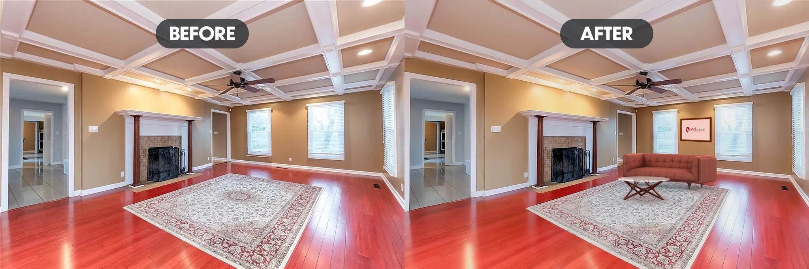

This image looked great to begin with. I used this as a demonstration of 3d object compositiing. The main issue I ran into was the distortion of the room based on the camera lens that was used to capture it. I could have used the camera raw filter in Photoshop to correct this distortion and then composite my 3d objects, but I'll just have to keep that in mind for future projects.

Here are a list of edits that I made: 

1. I added the table, couch, and hanging wall artwork to the room.
2. I adjusted the colors and 3d textures of each 3d object to better match the room's design.
3. I added 3d lighting to match the lights that were shown in the image. This gives the illusion that the lighting of the original image is interacting with the 3d objects.
4. Lastly, as with any convincing composite, I added some adjustments to the image as a whole to tie everything together.