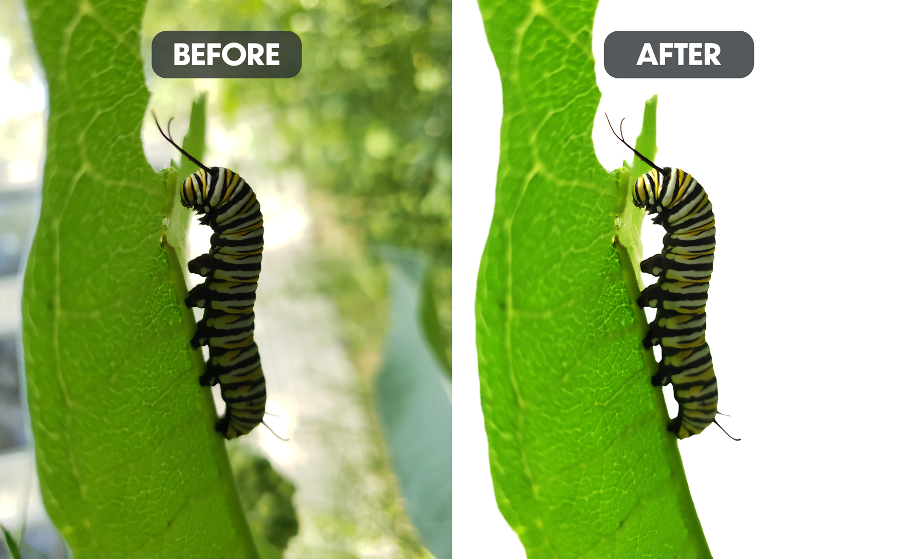

Monarch Caterpillars are truly beautiful creatures (if you're into that kind of thing). In case you didn't know, they **love** milkweed plants. Spread the love and increase the population of monarch butterflies by planting some near you.

This is a pretty basic example of background removal. After removing the background, I made some fairly minor color adjustments.