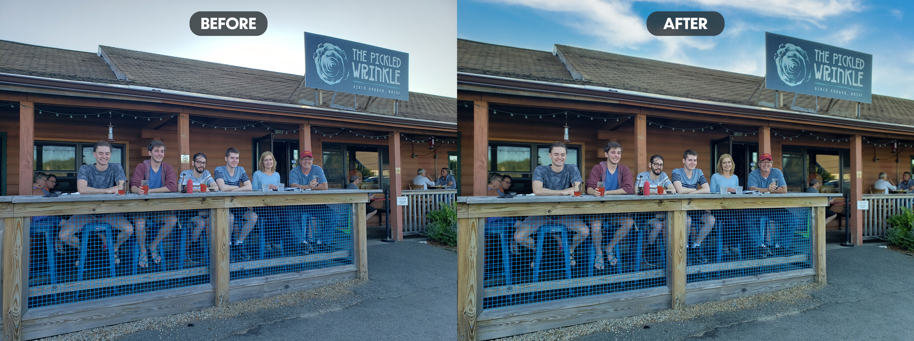

If you haven't made it to Maine yet, I'd highly recommend it as a travel destination. The coastline is absolutely incredible, the food is delicious, and the people are friendly. The Pickled Wrinkle is a popular restaurant located in Birch Harbor, as the sign says. If you go, you've obviously got to try the pickled wrinkles, but don't forget to branch out to the rest of their nummy menu. 

Here are a list of adjustments I made to this photo:

1. The sky was a bit boring in the original photo, so I replaced it with a more welcoming one with light, wispy clouds.
2. I made some substantial color corrections, which helped it out a ton.
3. Perhaps the most time-consuming edit was the blurred background. I selected the subjects and the railing in front of them and removed them from the background layer. When doing this, you can't simply blur the background right away or you'll end up with blurred outlines around each of the subjects. To fix this, I had to create a background behind the subjects that matched what would have shown behind them. Then I blurred this edited background layer.