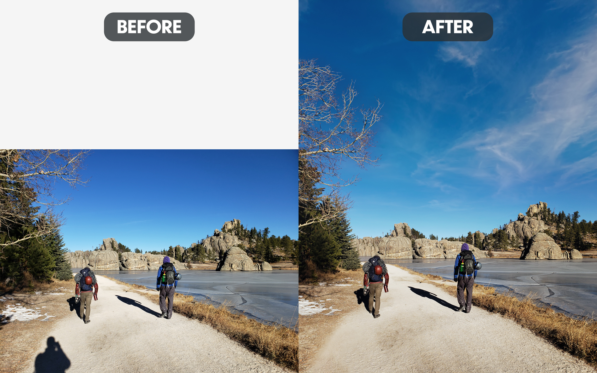

This photo was taken at Custer State Park next to Sylvan Lake. It's such a beautiful park and offers great hikes and rock climbing. I'd highly recommend the visit for a camping trip.

In this edit, I decided to add some sky. The sky was a bit boring to begin with, so I also replaced that with a few wispy clouds. I found that this made things more interesting, but didn't take away from the rest of the photo. The most difficult aspect was the creation of the top half of the tree on the left-hand side. I essentially duplicated, rotated, and resized existing tree branches and took some time to connect them in a way that looked fairly natural. Upon closer inspection, you may find that the shadows don't make perfect sense in some of the created branches... For my needs, this was acceptable, but I could have gone in and taken more time with this if I'd needed to. The most basic edit was the removal of my shadow in the bottom-left corner.