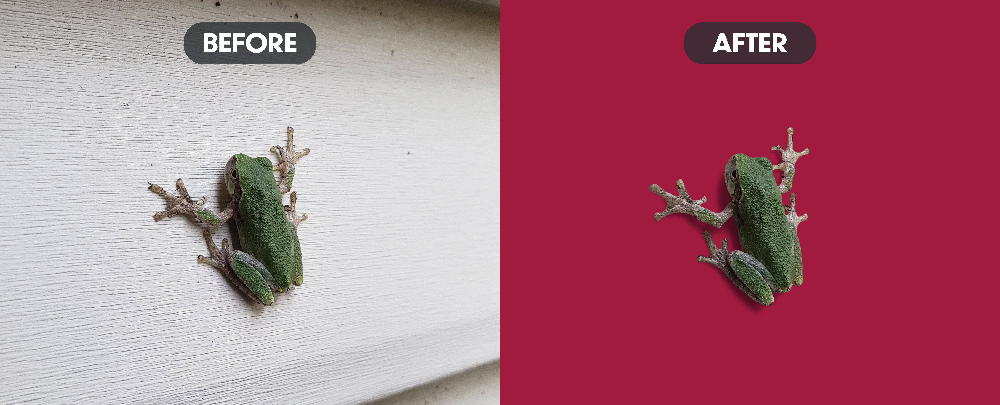

Frogs are the best. I found this one outside the house on the siding. Just chillin'. I've had a bit of an obsession with frogs since I was a kid and that hasn't gone away. Just ask my collection of frogs I keep by my plants. 

This serves as yet another basica example of background removal. The essentials such as removing the subject from its background and fixing the fringe took place first. Then, the original shadow was actually used (mostly). The only problem with it was the horizontal lines on the siding that still resided within the shadow. Thankfully, I was able to remove these lines with a directional blur. And we're left with this.