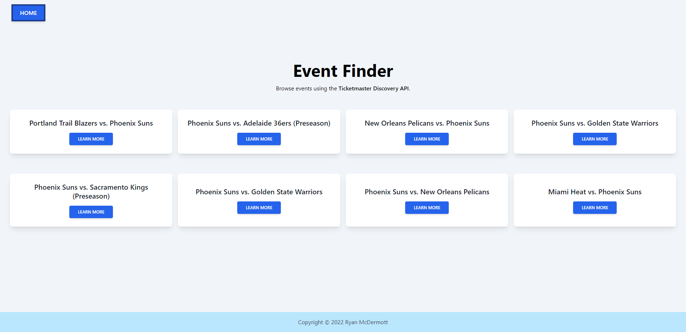

This site was built as part of a job application process using React.js and the Ticketmaster Discovery API. The documentation was pretty solid, but used older JavaScript, so some refactoring and research was involved to get my code to work in my React app. I also used this as an opportunity to learn and try Tailwind CSS. As of now, the site is far from stylish, but I have to say, I am now a BIG fan of Tailwind. I won't go into the details, but feel free to read more here: [tailwindcss.com](https://tailwindcss.com/).

I launched the demo site using GitHub Pages. Normally, when working with relative URLs, you can run into some issues when depoying to GitHub Pages (as I did). While there were some interesting workarounds that others found online, by far the most elegant solution I found was this nifty guide on YouTube from PedroTech: [How To Deploy A React App To Github Pages (Simple)](https://www.youtube.com/watch?v=Q9n2mLqXFpU). 

While I did run into some headaches along the way, I learned a lot from this one and am excited about the new technologies I learned. This is a working demo and I'll likely put more work into it in my free time as a way to get more practice with APIs.

See it for yourself at [ryanjmcdermott.github.io/ticketmaster-discovery-demo](https://ryanjmcdermott.github.io/ticketmaster-discovery-demo/).