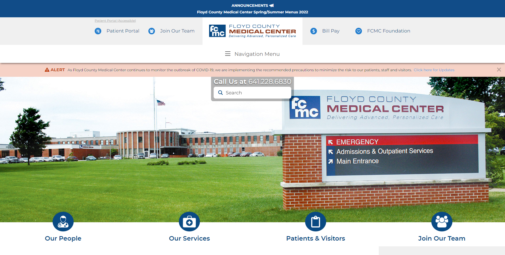

This site was built for Floyd County Medical Center while I was at Coloff Digital. Once our team had collected the necessary information from the client and our graphic designer's design was approved, we got to work building it. I was in charge of overseeing a team of developers that were building this. I provided them with content updates and development documentation to guide them through the correct processes. They got the majority of the grunt work done and then I was able to go in and refine their work.

Once the project was launched, I met with the client and taught the necessary team members how to manange the site on their end. It was a custom WordPress build, so we gave them access to the CMS admin portal.

It's worth noting that I no longer manage this site, so there have been some edits since I last laid hands on it. As of 5/12/2022, the site doesn't seem to have changed much apart from the more dynamic content, such as posts and slider images.

See it for yourself at [fcmc.us.com](https://www.fcmc.us.com).