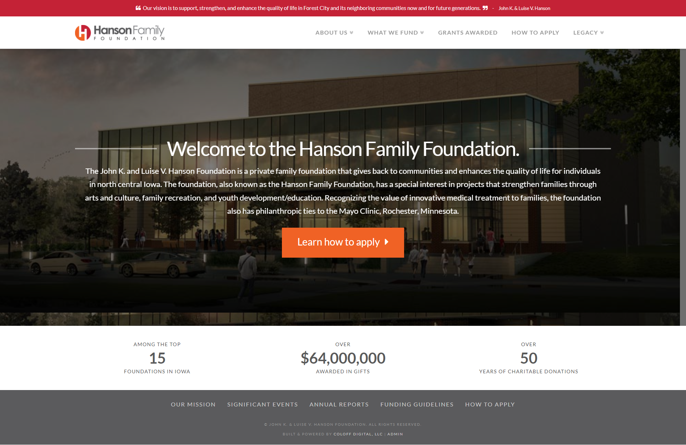

This site was built for Floyd County Medical Center while I was at Coloff Digital. After a general design was mocked up, I began building this out. I had quite a bit of creative freedom when it came to how the content of the other pages was displayed. 

It's worth noting that I no longer manage this site, so there may have been some edits since I last laid hands on it. As of 5/12/2022, the site doesn't seem to have changed much.

**Fun Fact:** Winnebago Industries, Inc. was founded by none other than John K. & Luise V. Hanson in 1962.

See it for yourself at [hansonfoundation.org](https://www.hansonfoundation.org).