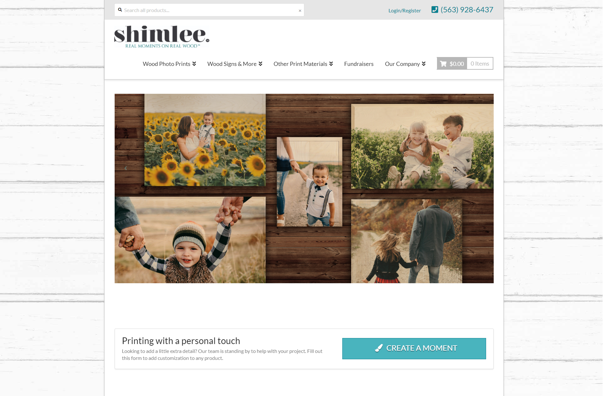

This site was built for shimlee, prior to my start at Coloff Digital. When I started there, we were in the support phase with this client's site. They allow customers to print their designs and photos on real wood.

The types of support requests varied greatly with shimlee. Since this was a custom-built WordPress site, that meant solving many unique problems for our client to achieve what they were looking for as closely as possible. I learned a lot from working on this site and also grew my appreciation for the customization of WordPress.

It's worth noting that I no longer manage this site, so there may have been some edits since I last laid hands on it. As of 5/12/2022, the site doesn't seem to have changed much.

Their products really are cool and would make for great gifts.

See it for yourself at [shimlee.com](https://www.shimlee.com).